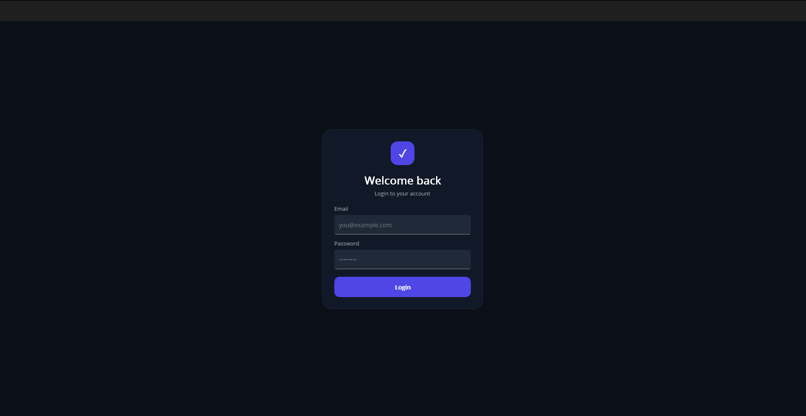
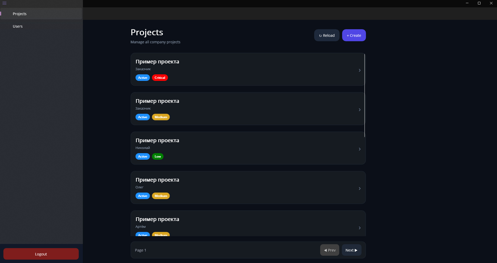
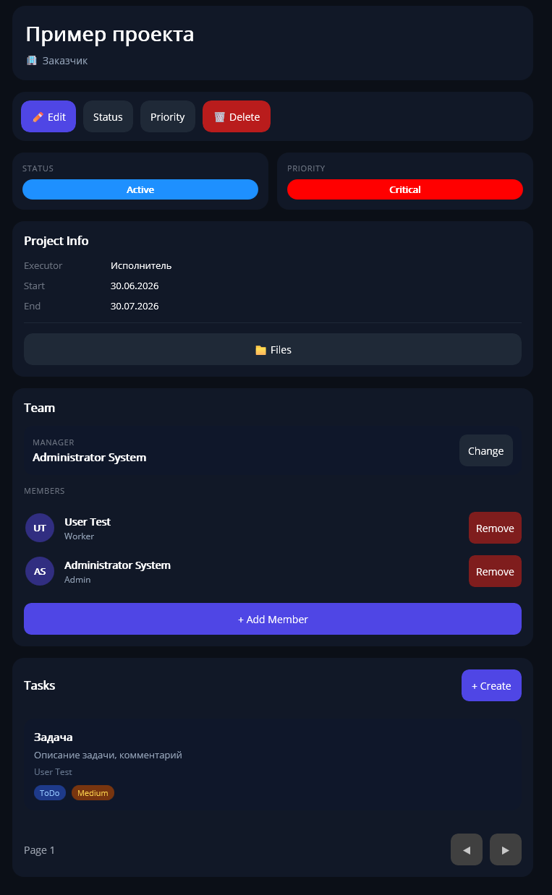
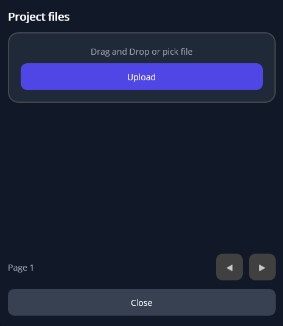
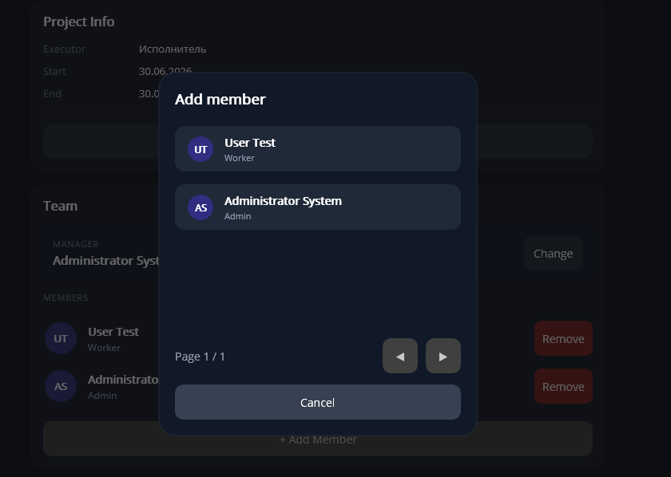
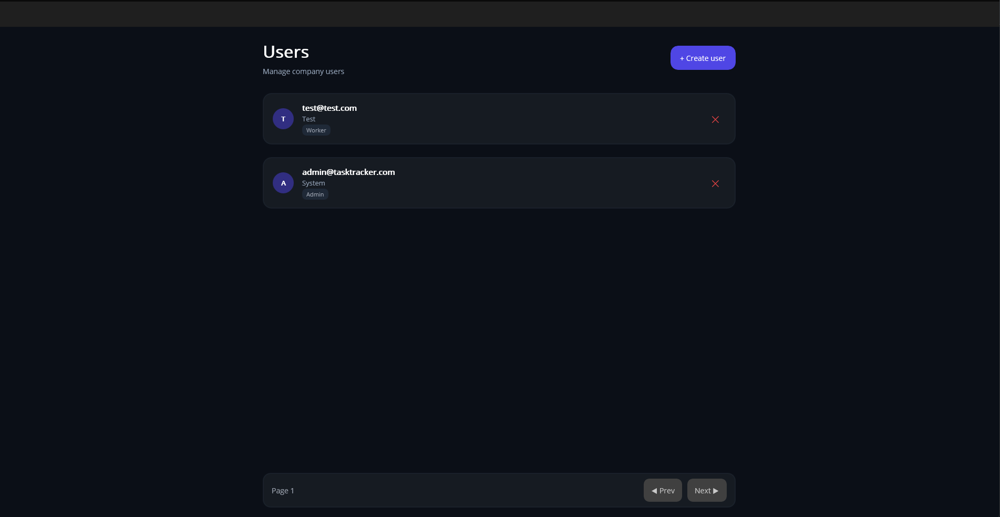
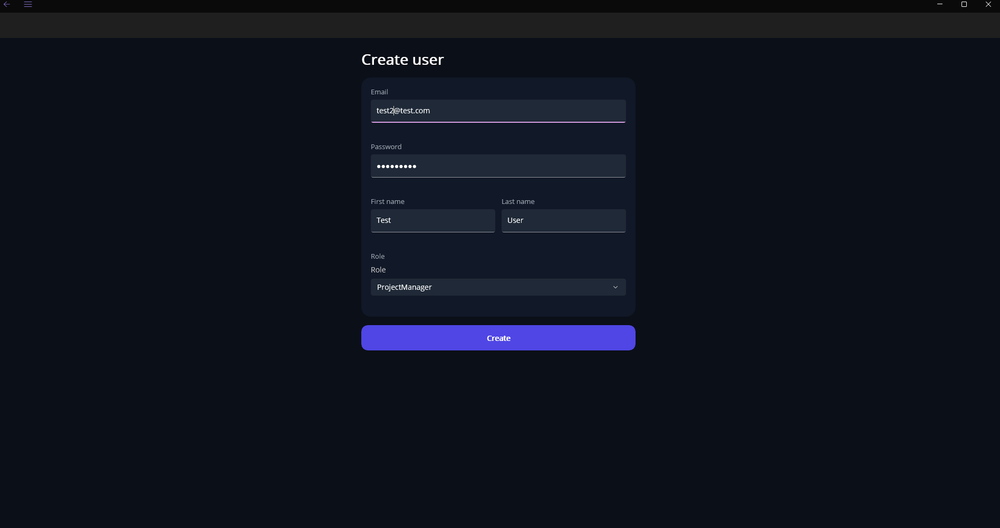
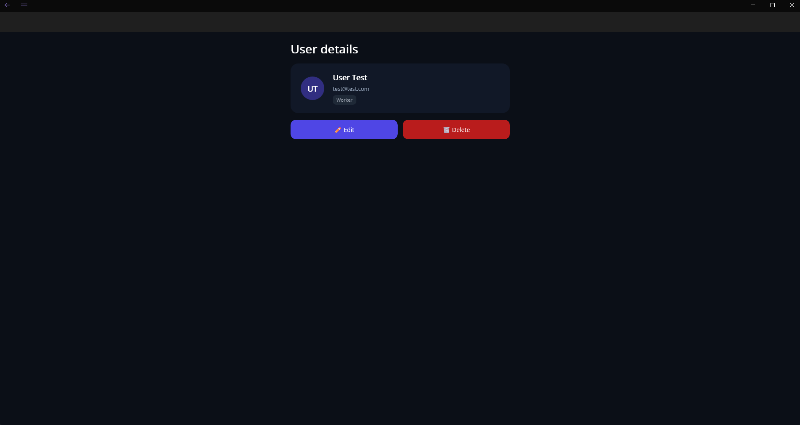

# TaskTracker


Система управления проектами и задачами с ролевой моделью доступа. Backend на ASP.NET Core (Clean Architecture) + desktop-клиент на .NET MAUI.

## Содержание

- [О проекте](#о-проекте)
- [Функционал](#функционал)
- [Архитектура](#архитектура)
- [Скриншоты](#скриншоты)
- [Стек](#стек)
- [Быстрый старт (backend)](#быстрый-старт-backend)
- [Desktop-клиент (Windows)](#desktop-клиент-windows)
- [Роли пользователей](#роли-пользователей)
- [Тестирование](#тестирование)
- [Управление контейнерами](#управление-контейнерами)
- [Сборка из исходников](#сборка-из-исходников)
- [Структура проекта](#структура-проекта)
- [Переменные окружения](#переменные-окружения)
- [Планы по развитию](#планы-по-развитию)

---

## О проекте

Pet-проект, написанный чтобы на практике закрепить Clean Architecture, ролевую авторизацию, работу с EF Core/MS SQL Server и полноценный деплой (Docker + автоматический HTTPS), а не остановиться на «работает на localhost».

Помимо backend'а, проект включает desktop-клиент на .NET MAUI с собственной логикой обработки ошибок сети, ретраев HTTP-запросов и постраничной навигацией — то есть это не просто CRUD API, а система с реальным клиентским приложением поверх него.

## Функционал

**Проекты**
- Создание, редактирование, удаление
- Смена статуса и приоритета
- Назначение менеджера проекта
- Добавление/удаление участников (с пагинацией)

**Задачи**
- Создание, редактирование, удаление
- Назначение исполнителя
- Смена статуса и приоритета
- Пагинация списка задач

**Документы**
- Загрузка, скачивание и удаление файлов проекта

**Доступ**
- 4 роли: `Admin`, `ChiefProjectManager`, `ProjectManager`, `Worker`
- У каждой роли — свой набор разрешённых действий, проверяемый **и на клиенте** (скрытие недоступных элементов UI), **и на сервере** (в use case'ах — на случай прямого вызова API в обход клиента)

## Архитектура

Backend построен по Clean Architecture с чётким разделением слоёв:

```
TaskTracker.Domain          — сущности и бизнес-правила, без внешних зависимостей
TaskTracker.Application     — use case'ы, интерфейсы репозиториев/сервисов
TaskTracker.Infrastructure  — EF Core, репозитории, JWT, файловое хранилище
TaskTracker.WebApi          — контроллеры, DI-регистрация, middleware
TaskTracker.Maui            — desktop-клиент (MVVM, CommunityToolkit.Mvvm)
```

Каждый юзкейс — отдельный класс с единственной ответственностью (`AddProjectMemberUseCase`, `ChangeWorkItemStatusUseCase` и т.д.), что упрощает тестирование и чтение бизнес-логики.

## Скриншоты

<p align="center">
  <b>Login</b><br><br>
  
</p>

<p align="center">
  <b>Projects</b><br><br>
  
</p>

<p align="center">
  <b>Project Details</b><br><br>
  
</p>

<p align="center">
  <b>Project Files</b><br><br>
  
</p>

<p align="center">
  <b>Add Member</b><br><br>
  
</p>

<p align="center">
  <b>Users</b><br><br>
  
</p>

<p align="center">
  <b>Create User</b><br><br>
  
</p>

<p align="center">
  <b>User Details</b><br><br>
  
</p>

## Стек

**Backend:** ASP.NET Core 10, Entity Framework Core, MS SQL Server, ASP.NET Identity, JWT, FluentValidation
**Desktop-клиент:** .NET MAUI 10 (Windows), CommunityToolkit.Mvvm, CommunityToolkit.Maui
**Тестирование:** xUnit
**Инфраструктура:** Docker, Docker Compose, Caddy (HTTPS reverse-proxy), GitHub Actions (CI)

---

## Быстрый старт (backend)

### Требования

- [Docker Desktop](https://www.docker.com/products/docker-desktop/)
- Git

### 1. Клонируйте репозиторий

```bash
git clone https://github.com/akanelovw/TaskTrackerClean.git
cd TaskTrackerClean
```

### 2. Создайте файл `.env`

```bash
cp .env.example .env
```

Откройте `.env` и заполните значения:

```env
ASPNETCORE_ENVIRONMENT=Production
DB_CONNECTION_STRING=Server=db,1433;Database=TaskTrackerDb;User Id=sa;Password=YourStr0ng!DbPassword;TrustServerCertificate=True
DB_PASSWORD=YourStr0ng!DbPassword
JWT_KEY=YourSuperSecretJwtKey_AtLeast32Characters_Long!
ADMIN_EMAIL=admin@yourdomain.com
ADMIN_PASSWORD=YourStr0ng!AdminPassword
DOMAIN=
ACME_EMAIL=
API_PORT=8080
```

> ⚠️ `DB_PASSWORD` должен содержать заглавные/строчные буквы, цифры и спецсимволы — требование MS SQL Server.
> ⚠️ `JWT_KEY` должен быть не короче 32 символов.
> ⚠️ `DB_PASSWORD` должен совпадать с паролем, указанным внутри `DB_CONNECTION_STRING`.

#### Хотите подключить свою базу данных вместо встроенной?

Замените всю строку `DB_CONNECTION_STRING` на адрес вашей БД:

```env
DB_CONNECTION_STRING=Server=my-external-db.com,1433;Database=TaskTrackerDb;User Id=myuser;Password=MyPassword;TrustServerCertificate=True
```

В этом случае сервис `db` из `docker-compose.yml` можно не запускать — см. шаг 3.

### 3. Запустите backend

**Со встроенной базой данных (по умолчанию):**

```bash
docker compose up -d --build
```

**С собственной внешней базой данных** (без контейнера `db`):

```bash
docker compose up -d --build api caddy
```

Дождитесь запуска (30–60 секунд). Проверить статус:

```bash
docker compose logs -f api
```

Когда увидите в логах `Создан админ ...` — backend готов и админ создан с данными из вашего `.env`.

API доступно по двум адресам одновременно:

- `http://localhost:8080/` — прямой доступ к контейнеру `api` (удобно для разработки и отладки клиента)
- `http://localhost/` (или `https://ваш-домен`, если настроен `DOMAIN`) — через reverse-proxy Caddy

### 4. Локальное тестирование Production-режима без домена

Если у вас пока нет домена и сервера — оставьте `DOMAIN` пустым в `.env`. Caddy в этом случае работает на `localhost` обычным HTTP без сертификата, а контейнер `api` доступен напрямую на порту `8080`. Этого достаточно для полноценного локального теста прод-сборки backend и MAUI-клиента.

### 5. HTTPS на реальном сервере (когда появится домен)

1. Направьте A-запись домена на IP вашего сервера.
2. В `.env` укажите:

```env
DOMAIN=api.yourdomain.com
ACME_EMAIL=you@yourdomain.com
```

3. Откройте порты **80** и **443** на сервере (firewall / security group облака).
4. Для безопасности закройте прямой доступ к `8080` снаружи — в `docker-compose.yml` у сервиса `api` замените `ports: ["8080:8080"]` на `expose: ["8080"]`, чтобы трафик шёл только через Caddy с HTTPS.
5. Запустите:

```bash
docker compose up -d --build
```

Caddy автоматически получит SSL-сертификат от Let's Encrypt и будет поддерживать его актуальным. API станет доступен по `https://api.yourdomain.com`.

### Переключение между Development и Production

Режим управляется переменной `ASPNETCORE_ENVIRONMENT` в `.env`:

```env
ASPNETCORE_ENVIRONMENT=Development   # включает Scalar UI на /scalar/v1, подробные ошибки
ASPNETCORE_ENVIRONMENT=Production    # для реального использования
```

После изменения пересоберите:

```bash
docker compose up -d --build api
```

---

## Desktop-клиент (Windows)

### Скачать готовую сборку

Скачайте архив с последним релизом со страницы [Releases](https://github.com/akanelovw/TaskTrackerClean/releases), распакуйте и запустите `TaskTracker.exe`.

> Установка .NET runtime **не требуется** — всё включено в архив (self-contained сборка).

### Настройка адреса API

В архиве рядом с `TaskTracker.exe` лежит файл `config.json`:

```json
{
  "ApiBaseUrl": "http://localhost:8080/"
}
```

Если ваш backend запущен на другом адресе — откройте `config.json` в любом текстовом редакторе, измените адрес и перезапустите приложение. **Пересборка не требуется.**

> Если файл `config.json` отсутствует или повреждён — приложение использует адрес `http://localhost:8080/` по умолчанию.

Примеры значений:

- Backend в Docker на этой же машине: `http://localhost:8080/`
- Backend через Caddy на этой же машине (без домена): `http://localhost/`
- Backend на другой машине в локальной сети: `http://192.168.1.10:8080/`
- Backend на реальном сервере с доменом: `https://api.yourdomain.com/`

### Войдите в систему

Используйте учётные данные из вашего `.env`:

| Поле     | Значение                            |
| -------- | ------------------------------------ |
| Email    | значение `ADMIN_EMAIL` из `.env`    |
| Password | значение `ADMIN_PASSWORD` из `.env` |

---

## Роли пользователей

| Роль                    | Возможности                                                |
| ------------------------ | ----------------------------------------------------------- |
| **Admin**               | Полный доступ ко всему, управление пользователями          |
| **ChiefProjectManager** | Все проекты, создание проектов, назначение менеджеров      |
| **ProjectManager**      | Только свои проекты, создание задач, управление командой   |
| **Worker**              | Только свои задачи, смена статуса назначенных задач         |

---

## Тестирование

Проект покрыт тремя видами тестов:

| Проект                                | Что проверяет                                    |
| -------------------------------------- | ------------------------------------------------- |
| `TaskTracker.Domain.Tests`            | Бизнес-правила доменных сущностей                 |
| `TaskTracker.Application.Tests`       | Логику use case'ов (в изоляции, с моками)         |
| `TaskTracker.Api.IntegrationTests`    | Полный HTTP-цикл API поверх реальной инфраструктуры |

Запуск unit-тестов локально:

```bash
dotnet test TaskTracker.Domain.Tests/TaskTracker.Domain.Tests.csproj
dotnet test TaskTracker.Application.Tests/TaskTracker.Application.Tests.csproj
```

При каждом push в `master` тесты автоматически прогоняются в GitHub Actions — см. бейдж `Build` в начале файла.

---

## Управление контейнерами

```bash
# Запустить
docker compose up -d

# Остановить (данные сохраняются)
docker compose down

# Остановить и удалить все данные (включая базу данных!)
docker compose down -v

# Посмотреть логи API
docker compose logs -f api

# Посмотреть логи базы данных
docker compose logs -f db

# Посмотреть логи Caddy
docker compose logs -f caddy

# Пересобрать после изменений в коде
docker compose up -d --build
```

---

## Сборка из исходников

### Backend

Требуется только Docker Desktop:

```bash
docker compose up -d --build
```

### Desktop-клиент (Windows)

**Требования:**

- [.NET 10 SDK](https://dotnet.microsoft.com/download/dotnet/10)
- Windows 10 версии 19041 или новее
- Рабочая нагрузка `.NET MAUI` (`dotnet workload install maui-windows`)

> Если SDK обновился до новой feature-band версии и появляются ошибки про несовместимые версии рантайма пакетов (`NU1102` для `Microsoft.NETCore.App.Runtime.*`), выполните `dotnet workload update`, затем `dotnet workload install maui-windows android ios maccatalyst`, и при необходимости очистите кэш сборки: `find . -type d \( -name "bin" -o -name "obj" \) -exec rm -rf {} +`.

```bash
dotnet restore TaskTracker.Maui/TaskTracker.Maui.csproj -p:TargetFrameworks=net10.0-windows10.0.19041.0

dotnet publish TaskTracker.Maui/TaskTracker.Maui.csproj \
  -f net10.0-windows10.0.19041.0 \
  -c Release \
  -p:TargetFrameworks=net10.0-windows10.0.19041.0 \
  -p:WindowsPackageType=None \
  -p:SelfContained=true \
  -p:RuntimeIdentifier=win-x64 \
  --no-restore \
  -o ./publish/windows
```

> Параметр `-p:TargetFrameworks=net10.0-windows10.0.19041.0` обязателен — проект мультитаргетный (Android/iOS/MacCatalyst/Windows), и без него restore попытается резолвить зависимости сразу для всех платформ, что приводит к ошибкам поиска несуществующих пакетов.

После публикации скопируйте конфиг рядом с собранным `.exe`:

```bash
cp TaskTracker.Maui/config.json ./publish/windows/config.json
```

Готовый `TaskTracker.exe` вместе с `config.json` будет в папке `publish/windows`.

```powershell
Compress-Archive -Path ./publish/windows/* -DestinationPath TaskTracker-win-x64.zip
```

---

## Структура проекта

```
TaskTrackerClean/
├── TaskTracker.WebApi/               # ASP.NET Core Web API
├── TaskTracker.Application/          # Use cases, интерфейсы
├── TaskTracker.Application.Tests/    # Unit-тесты use case'ов
├── TaskTracker.Domain/               # Доменные сущности
├── TaskTracker.Domain.Tests/         # Unit-тесты домена
├── TaskTracker.Infrastructure/       # EF Core, репозитории, сервисы
├── TaskTracker.Api.IntegrationTests/ # Интеграционные тесты API
├── TaskTracker.Maui/                 # .NET MAUI клиент (Windows)
├── .github/workflows/ci.yml          # CI: build + test
├── docker-compose.yml
├── Caddyfile
├── .env.example
└── README.md
```

---

## Переменные окружения

| Переменная               | Описание                                                              |
| ------------------------- | ----------------------------------------------------------------------- |
| `ASPNETCORE_ENVIRONMENT` | `Development` или `Production`                                        |
| `DB_CONNECTION_STRING`   | Полная строка подключения к БД (своя или встроенная в docker-compose) |
| `DB_PASSWORD`            | Пароль SA для встроенного контейнера MS SQL Server                    |
| `JWT_KEY`                | Секретный ключ для подписи JWT (мин. 32 символа)                      |
| `ADMIN_EMAIL`            | Email администратора, создаваемого автоматически при первом запуске   |
| `ADMIN_PASSWORD`         | Пароль администратора, создаваемого автоматически при первом запуске  |
| `DOMAIN`                 | Домен для автоматического HTTPS через Let's Encrypt (необязательно)   |
| `ACME_EMAIL`             | Email для регистрации сертификата Let's Encrypt (необязательно)       |
| `API_PORT`               | Порт, на котором Caddy публикует API (по умолчанию 80)                |

---

## Планы по развитию

- [ ] Покрыть Infrastructure-слой тестами
- [ ] Добавить сборку под Android
- [ ] Email-уведомления о назначении задачи
- [ ] Rate limiting на API

---

## Лицензия

[MIT](./LICENSE.txt)
